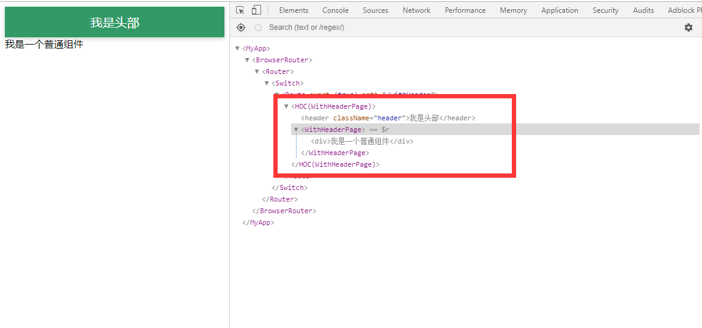
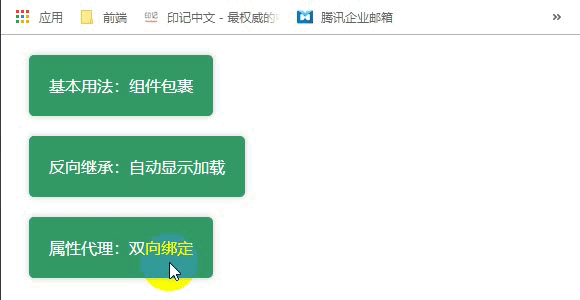

## 初识 React 高阶组件

### 1. 前言

---

&emsp;&emsp;在我刚来公司面试时，公司面试题附加题的最后一道大题就是：高阶组件的意义。在当时，我对高阶组件并不是很了解的，对自己的回答也并不是很满意。于是面试之后我查阅了一些资料，并咨询了我的朋友李金珂，算是对的高阶组件有了一些了解。在这里将我对高阶组件的一些理解记录并分享给大家，希望能让大家有所收获。

### 2. 什么是高阶组件？

---

&emsp;&emsp;高阶组件：Higher Order Component，简称 HOC。通俗点说，高阶组件其实就是一个 React 组件包裹着另一个 React 组件。再通俗一点来说，比如我有一包土司，一块火腿，我将火腿用土司包裹起来，通过制作三明治的方法就可以得到一份火腿三明治。而如果我想要一个培根三明治，只要将火腿换成培根即可。用伪代码可表示为：

```
    const 火腿三明治 = 制作三明治(火腿)(土司)
    // or
    const 培根三明治 = 制作三明治(培根)(土司)
```

在这里，我们可以将火腿和培根看成一个组件，使用制作三明治将它们用组件土司包裹起来，就得到了最终生成的组件——三明治，而制作三明治这个方法，我们称它为：高阶组件。这里需要注意一下，高阶组件虽然名字叫组件，但它其实是函数。

### 3. 实际操作

---

- #### 3.1 实现一个最简单的高阶组件

&emsp;&emsp;首先，让我们来实现一个最简单的高阶组件，它接受一个 React 组件作为参数，包裹后将其返回。

```
    import React, { PureComponent } from 'react'
    import './styles.css'

    export default WrappedComponent => (
        class HOC extends PureComponent {

            constructor(props) {
                super(props)
            }

            render() {
                return (
                    <>
                        <header className="header">Header</header>
                        <WrappedComponent {...this.props} />
                    </>
                )
            }
        }
    )
```

&emsp;&emsp;在上面代码中使用了`<React.Fragment>`的语法糖`<></>`来代替`<React.Fragment></React.Fragment>`，现在让我们在其他组件中使用这个高阶组件。

```
    import React, { PureComponent } from 'react'
    import WithHeader from './Components/WithHeader'

    @WithHeader
    export default class WithHeaderPage extends PureComponent {
        render() {
            return <div>我是一个普通组件</div>
        }
    }
```

&emsp;&emsp;在上面代码中使用了`decorator`语法糖来提升代码写法上的简洁优雅，你也可以不使用它，使用下面的代码也是同样的效果

```
    export default WithHeader(WithHeaderPage)
```

&emsp;&emsp;最后，打开浏览器，效果如下图:


&emsp;&emsp;可以看到`WithHeaderPage`组件已经被`HOC`组件包裹了起来，达到了我们的预期效果。但是还有一个小问题就是，假如这个高阶组件被使用了很多次，那么在调试的时候我们会看见很多同名的`HOC`组件，不利于调试，所以我们应该给高阶组件加上名字，便于我们调试。

&emsp;&emsp;我们来改写一下之前的高阶组件代码，增加 getDisplayName 函数以及静态属性 displayName，然后我们再次打开浏览器看看效果。

```
    import React, { PureComponent } from 'react'
    import './styles.css'

    const getDisplayName = component => {
        return component.displayName || component.name || 'Component'
    }

    export default WrappedComponent => (
        class WithHeader extends PureComponent {
            static displayName = `HOC(${getDisplayName(Component)})`

            constructor(props) {
                super(props)
            }

            render() {
                return (
                    <>
                        <div className="demo-header">我是标题</div>
                        <WrappedComponent {...this.props} />
                    </>
                )
            }
        }
    )
```


&emsp;&emsp;此时可以看到，原本组件的名称正确地显示在了 HOC 组件上。

&emsp;&emsp;在这个例子中，高阶组件只做了一件事情，就是给被包裹组件添加了一个 Header。任何需要添加 Header 的组件都可以通过这个高阶组件包裹实现。同理，我们可以将组件的通用逻辑封装并抽离至高阶组件中，让此部分逻辑在组件间更好地被复用。

- #### 3.2 略微进阶一点的用法

&emsp;&emsp;在上面的例子中，Header 中的文字是固定的，在我们实际的使用中，可能更加希望它是一个可以传入的参数，现在我们再对上面例子做一些修改。

&emsp;&emsp;首先，getDisplayName 函数会在我们接下来所有例子中使用，我们先将他抽离出来，单独封装在`utils.js`中。

```
    export const getDisplayName = component => {
        return component.displayName || component.name || 'Component';
    };
```

&emsp;&emsp;现在我们开始对上面的高阶组件进行修改，让它可以接收一个标题做参数，然后返回一个高阶组件。

```
    import React, { PureComponent } from 'react'
    import { getDisplayName } from '../utils'
    import './styles.css'

    export default (title = 'Header') => WrappedComponent => (
        class WithHeader extends PureComponent {
            static displayName = `HOC(${getDisplayName(WrappedComponent)})`

            constructor(props) {
                super(props)
            }

            render() {
                return (
                    <>
                        <header className="header">{title}</header>
                        <WrappedComponent {...this.props} />
                    </>
                )
            }
        }
    )
```

&emsp;&emsp;调用方式也需要修改一下。

```
    import React, { PureComponent } from 'react'
    import WithHeader from './Components/WithHeader'

    @WithHeader('我是头部')
    export default class WithHeaderPage extends PureComponent {
        render() {
            return <div>我是一个普通组件</div>
        }
    }
```

&emsp;&emsp;最后的效果如下图：



- #### 3.3 反向继承

&emsp;&emsp;反向继承：就是让高阶组件返回的 React 组件继承被传入的组件。如：

```
    export default (WrappedComponent) => (
        class Inheritance extends WrappedComponent {
            constructor(props) {
                super(props)
            }

            componentDidMount() {
                // 可以方便地得到state，做一些更深入的修改。
                console.log(this.state);
            }

            render() {
                return super.render();
            }
        }
    }
```

&emsp;&emsp;下面让我们一起通过反向继承的方式实现一个 Loading 组件。

```
    import React from 'react'
    import { getDisplayName } from '../utils'
    import './styles.css'

    export default WrappedComponent => (
        class WithLoading extends WrappedComponent {
            static displayName = `HOC(${getDisplayName(WrappedComponent)})`

            constructor(props) {
                super(props)
            }

            render() {
                return this.state.list.length === 0 ? (
                    <div className="flex">
                        <div className="loading">Loading...</div>
                    </div>
                ) : (
                    super.render()
                )
            }
        }
    )
```

&emsp;&emsp;调用方式和之前最不传参数的写法一样。

```
    import React, { PureComponent } from 'react'
    import WithLoading from './Components/WithLoading'

    @WithLoading
    export default class WithLoadingPage extends PureComponent {
        state = {
            list: []
        }

        componentDidMount() {
            // 模拟请求数据
            setTimeout(() => {
                this.setState({
                    list: ['上联：去年五放加里奥', '下联：今年三秀卢锡安', '横批：闪现回国']
                })
            }, 2000)
        }

        render() {
            const { list } = this.state
                return (
                <>
                    <h2>加载完成</h2>

                    {list.map((value, i) => {
                        return <p key={i}>{value}</p>
                    })}
                </>
            )
        }
    }
```

&emsp;&emsp;效果如下图：


&emsp;&emsp;通过反向继承的方式，我们可以很容易的拿到原组件中的 state 和 props 等信息。然后我们通过判断 state 中 list 的长度，来决定如何渲染该组件，这样就实现了一个简单的 Loading 组件。

- #### 3.4 属性代理

&emsp;&emsp;高阶组件会包裹在普通组件外层，所以任何要传入普通组件内的 props 或者 state 首先都要经过高阶组件。于是高阶组件就拥有了提前对这些属性进行修改的能力。属性代理指的就是高阶组件将这些属性修改后再传给被包裹组件。下面让我们一起通过属性代理的方式模拟实现一个类似 Angular 的数据双向绑定。

```
    import React from 'react'
    import { getDisplayName } from '../utils'

    export default WrappedComponent => (
        class WithBind extends WrappedComponent {
            static displayName = `HOC(${getDisplayName(WrappedComponent)})`

            constructor(props) {
                super(props)
            }

            state = {
                value: ''
            }

            onChange = e => {
                this.setState({
                    value: e.target.value
                })
            }

            render() {
                const newProps = {
                    withBind: {
                        value: this.state.value,
                        onChange: this.onChange
                    },
                    getValues: () => this.state
                }
                return <WrappedComponent {...this.props} {...newProps} />
            }
        }
    )
```

&emsp;&emsp;同样需要在其他地方调用一下。

```
    import React, { PureComponent } from 'react'
    import WithBind from './Components/WithBind'

    @WithBind
    export default class WithBindPage extends PureComponent {
        getValues = () => {
            const values = this.props.getValues()
            alert(JSON.stringify(values, null, 2))
        }

        render() {
            return (
                <>
                    <h2>双向绑定</h2>

                    <input type="text" {...this.props.withBind} />

                    <pre>{JSON.stringify(this.props.getValues(), null, 2)}</pre>

                    <button onClick={this.getValues}>获取value</button>
                </>
            )
        }
    }
```

&emsp;&emsp;效果如下图：



&emsp;&emsp;上面例子通过属性代理的方式，将被包裹组件所需要的信息通过属性传递的方式传给它，模拟实现了一个简单的苏剧双向绑定。

### 4. 总结

---

&emsp;&emsp;以上便是我对 React 高阶组件的一些理解，如果现在再让我去写那道面试题，我可能会写：React 高阶组件其实就是装饰器模式与React相爱后的爱情结晶，它可以抽离不同组件中的公共逻辑，使得组件更加单一化，提高组件的复用性。
